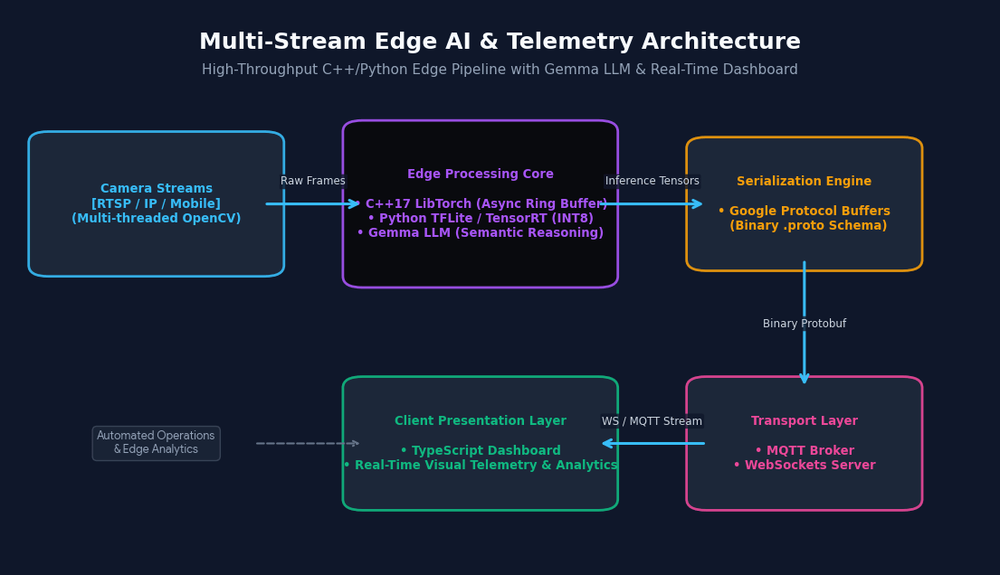

  

# Peace be upon you! I'm RaML 👨🏿‍💻
### Edge AI Systems Architect & Embedded Computer Vision Engineer

My core expertise revolves around spatial, surface, fabric and thermal analysis. In my workflows i'm skilled at building C++ multi-threaded vision backends, optimizing deep learning models for hardware-specific engines (such as TensorRT and TensorFlow Lite), deploying localized Edge LLMs (Gemma), and engineering visual data dashboard environments.

### 🛠️ Core Architectural Tech Stack

| Operational Layer | Core Technologies & Tooling |
| :--- | :--- |
| **Deep Learning & Edge LLMs** | PyTorch Core • TensorFlow Lite • LibTorch (C++) • TensorRT API • ONNX • Gemma LLM |
| **Systems & Concurrency** | Modern C++ (C++17) • Python • C++ Multithreading (`std::thread`, `std::mutex`) • CUDA |
| **DevOps & Cloud Networks** | Docker (Multi-Arch Containers) • Kubernetes (K8s) • Terraform (IaC) • Google Cloud VPC |
| **Infrastructure & Wire Transport** | Google Protocol Buffers (Protobuf) • MQTT Brokers • WebSockets • OpenCV • Linux |
| **Presentation & Dashboard** | **TypeScript** • Next.js App Router • Tailwind CSS • Live Canvas API |

---

### 🏗️ Production Showcase Repositories

My 4 pinned repositories form a modular, live breakdown of the **Edge Processing Core**, **Serialization Engine**, **Cloud Routing**, and **Presentation Layers** visualized in the architecture banner above:

*   **[edge-ai-quantization-compiler](https://github.com/Ramel-CTO/edge-ai-quantization-compiler):** Covers graph parsing and hardware compilation. Traces PyTorch graphs into `ONNX` and utilizes `IInt8EntropyCalibrator2` to compile low-latency, optimized INT8 execution engines for deployment on edge processors.
*   **[pytorch-multistream-telemetry-backend](https://github.com/Ramel-CTO/pytorch-multistream-telemetry-backend):** High-throughput, pure C++17 ingestion. Bypasses Python's Global Interpreter Lock (GIL) utilizing an atomic frame ring buffer queue to pipe data smoothly onto GPU inference grids. Packaged as a **Multi-Arch Docker container** for NVIDIA Jetson platforms.
*   **[tflite-mobile-edge-vision](https://github.com/Ramel-CTO/tflite-mobile-edge-vision):** Lightweight mobile edge runtime and wire transport layer. Focuses on offloading tasks to mobile hardware delegates and packing metadata into hyper-compressed binary `Protobuf` schemas. Secured cloud ingestion is provisioned via **Terraform infrastructure scripts deploying an isolated Google VPC**.
*   **[typescript-telemetry-visualizer](https://github.com/Ramel-CTO/typescript-telemetry-visualizer):** The Client Presentation Layer of the ecosystem. A real-time **TypeScript/Next.js dashboard** that opens concurrent WebSocket connections to swallow, parse, and map active multi-stream bounding box structures and Gemma automation outputs natively with zero rendering lag, orchestrated via **Kubernetes**.

---

### 📫 Connect With Me
* **LinkedIn:** https://www.linkedin.com/in/ramelcto
* **Restricted Access / CV Labs:** https://ramel-cto.github.io/raml_portfolio/
* **Email:** ramelr@sudflow.com
